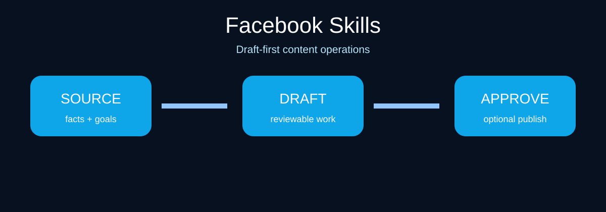

# Facebook Skills for Claude Code and Codex

[](.claude-plugin/plugin.json)
[](.codex-plugin/plugin.json)
[](SKILL.md)
[](https://socialbu.com/mcp-server)
[](LICENSE)

**Facebook Skills** is a draft-first operating kit for Page posts, campaign briefs, event promotion, community replies, profile positioning, and content planning. It turns verified material into reviewable Facebook work without inventing results, claiming live Page access, or publishing by default.



## Start here

1. Install the bundle in your agent.
2. Provide Page context, campaign goal, audience, source facts, event details, and available creative assets.
3. Request one deliverable: a Page post, campaign brief, event sequence, reply queue, or plan.
4. Review claims, links, event logistics, media, and account choice before any schedule or publish action.

## Install

### Codex CLI
```bash
codex plugin marketplace add samalyxx/facebook-skills
codex plugin add facebook-skills@facebook-skills
```

### Claude Code
```text
/plugin marketplace add samalyxx/facebook-skills
/plugin install facebook-skills@facebook-skills
```

### Local or any compatible agent
```bash
git clone https://github.com/samalyxx/facebook-skills.git
cd facebook-skills
npx skills add .
```

## Ask for work in plain language

- “Write three Page-post options for this local event; preserve these dates, ticket terms, and accessibility details.”
- “Build a campaign brief for this launch: audience, message, creative assets, CTA, and how we will learn.”
- “Draft replies to these Page comments and flag support, safety, and refund issues for a human.”
- “Turn this announcement into an event-promotion sequence for the two weeks before launch.”

## The 12 skills

| Skill | Use it for |
| --- | --- |
| Page post writer | Factual Page posts with a clear next action. |
| Campaign brief | Audience, message, assets, CTA, risks, and measurement plan. |
| Event promotion | Accurate event copy, timeline, logistics checklist, and reminders. |
| Comment replies | Helpful public replies and owner escalation. |
| Content planner | Themes, formats, cadence, owners, and experiments. |
| Copy humanizer | Clearer voice without invented personal experience or proof. |
| Repurposer | Faithful adaptation into Page posts and related formats. |
| Profile optimizer | Page About, category, positioning, and proof-point recommendations. |
| Community manager | Triage, priority queues, risk flags, and moderation cues. |
| Social listener | Synthesis from supplied conversations or research only. |
| Analytics | Observations, hypotheses, and next actions from exports. |
| Safety review | Claims, event details, disclosures, tone, and approval readiness. |

## Optional: schedule or publish with SocialBu

Facebook Skills writes and checks the work. [SocialBu](https://socialbu.com/publish) is optional for connected-account drafts, scheduling, and publishing.

1. In SocialBu **Accounts**, connect the exact Facebook Page you intend to use.
2. Add `https://socialbu.com/mcp` to your compatible client and complete OAuth in your browser.
3. Create a draft with the final copy, links, images/video, Page, and intended action.
4. Before execution, the agent must show the exact content, Page, media, action (**save draft**, **schedule**, or **publish now**), and time/timezone.
5. It can act only after a fresh confirmation for that unchanged preview. Edits require a new approval.

Manual scheduling through SocialBu is also available. See [the publishing boundary](references/socialbu-publishing.md).

## Verify a checkout

```bash
./scripts/validate.sh
python3 -m unittest discover -s tests
python3 scripts/selftest.py
```

## Contribute and license

Read [CONTRIBUTING.md](CONTRIBUTING.md), [CLAUDE.md](CLAUDE.md), and [SECURITY.md](SECURITY.md). MIT licensed; see [LICENSE](LICENSE). This independent project is not affiliated with Facebook, Claude, Codex, or SocialBu.

## Related open-source skill bundles

- [LinkedIn Skills](https://github.com/samalyxx/linkedin-skills)
- [X Skills](https://github.com/samalyxx/x-skills)
- [Instagram Skills](https://github.com/samalyxx/instagram-skills)
- [YouTube Skills](https://github.com/samalyxx/youtube-skills)
- [Threads Skills](https://github.com/samalyxx/threads-skills)
- [TikTok Skills](https://github.com/samalyxx/tiktok-skills)
